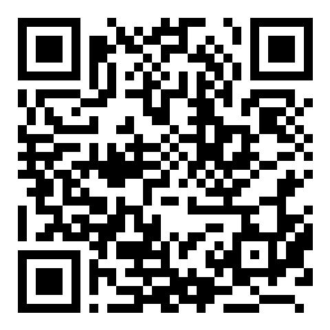
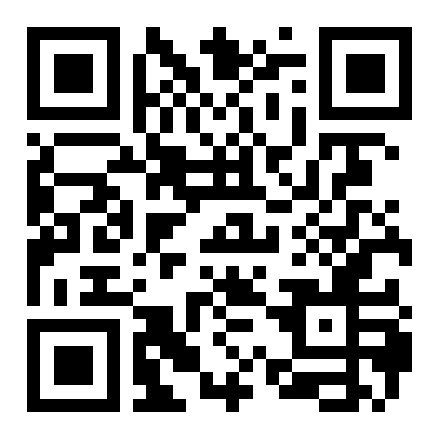
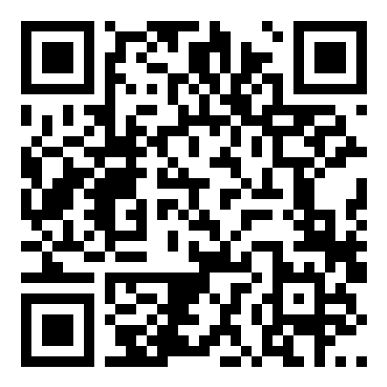
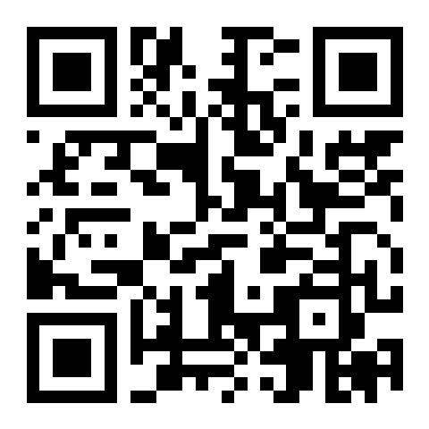
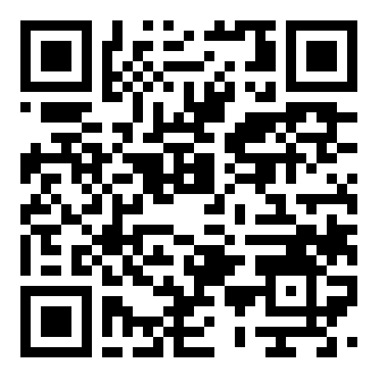

# Donate to Form

Form is free — no ads, no tracking, no accounts. If it helps your training and you'd like to support development, crypto donations are appreciated.

> [!IMPORTANT]
> Send **only the matching network** to each address — a transaction sent on the wrong network is unrecoverable. Donations are voluntary and non-refundable; they don't unlock any features, they just support the work.

## Bitcoin (BTC)

**Network:** Bitcoin on-chain

```
bc1pvujwgljmpdmc4897pd6ujwkmycypdfmzeedt3e9nzaw9ghmtr5aqm06hs4
```



## Ethereum (ETH) & ERC-20

**Network:** Ethereum (ETH, USDT, USDC and other ERC-20 tokens)

```
0xEAF538dE44034c96D24F61ad7eaDc477fd7B7ac1
```



## Solana (SOL) & SPL

**Network:** Solana (SOL, USDT and other SPL tokens)

```
F2H2YxQZQQBGbk7EGG8EKjbUtLsSjcuzA5fMRJF9W7KS
```



## Tron (TRX) & TRC-20

**Network:** TRON (TRX, USDT and other TRC-20 tokens)

```
TBitYa3rCpBfw5umL7xTD2dXoLkqDaQsTJ
```



## TON

**Network:** TON (TON, USDT and other jettons)

```
UQCV0o2t6lF-wufTPJqhCxUdNhuf3dOyxlJf1N3nnVufAz0z
```



---

Thank you for supporting Form 💪

Back to the app: [Download the latest APK](https://github.com/TheHHR/Form/releases/latest)
