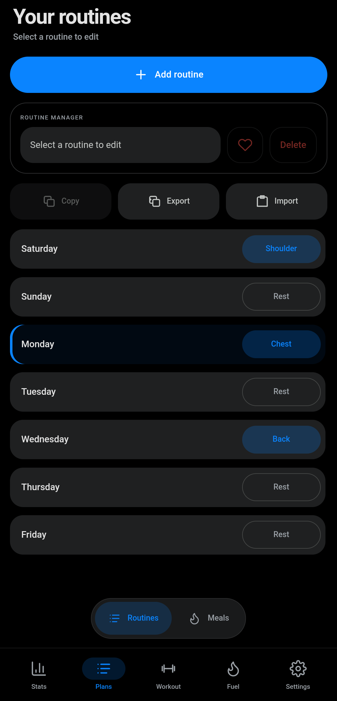
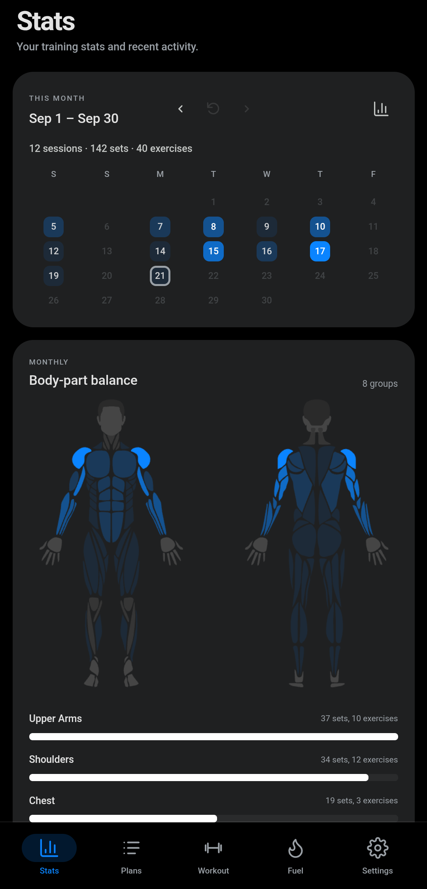
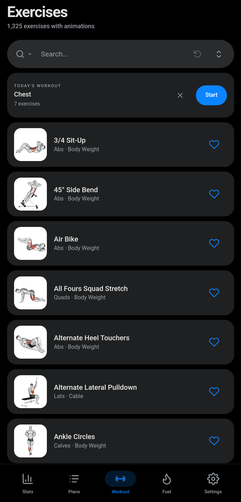
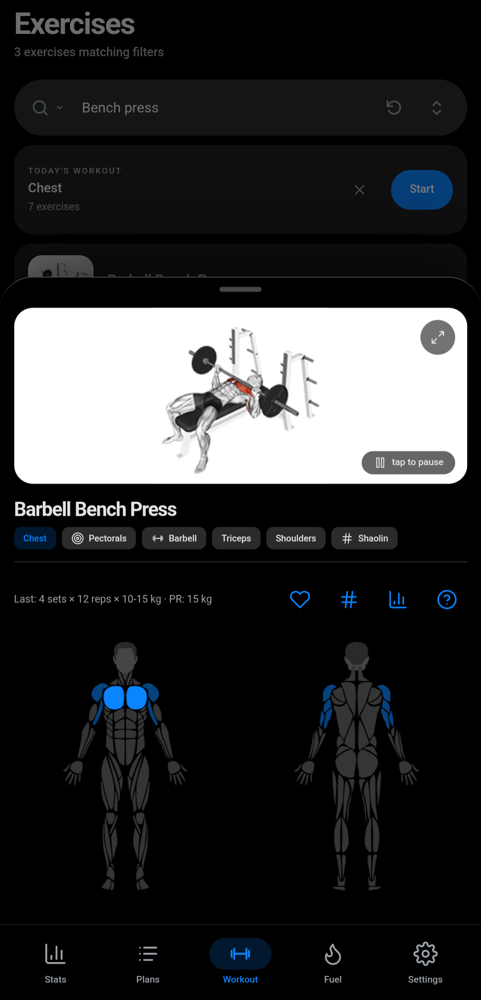

# Form — Training & Nutrition

An offline-first training and nutrition tracker for Android. Plan routines, log workouts with built-in rest timers and a visual exercise library, track meals and macros, and review progress — all your data stays on your device in your own storage folder.

## Features

- **Training** — scheduled routines, a guided active-workout screen with rest timers, set/rep/weight logging, supersets and secondary exercises
- **Exercise library** — hundreds of exercises with animated demos, categories, and custom exercise support
- **Nutrition** — meal logging with a food database, macro/calorie tracking, water intake
- **Progress** — training history, charts, and body-metrics tracking
- **Own your data** — everything lives in a plain-text vault (.md) in a folder you pick on your device; export/import anytime. No servers, no accounts, no tracking.

## Download

Grab the latest signed APK from [Releases](https://github.com/TheHHR/Form/releases/latest) — every push to `main` rebuilds it automatically. Requires Android 10+.

## Screenshots

| | |
|---|---|
|  |  |
|  |  |

## Donate

If Form helps your training, consider supporting development:

## Built with

- Vanilla HTML/CSS/JS web app, wrapped with [Capacitor](https://capacitorjs.com)
- Custom SAF vault plugin for secure user-picked storage
- Screen wake lock during active workouts via `@capacitor-community/keep-awake`

## Repository

- `www/` — the web app (source of truth)
- `android/` — native Android project (Gradle)
- `.github/workflows/android-build.yml` — CI: builds the signed release APK and publishes it to the [latest release](https://github.com/TheHHR/Form/releases/latest)
